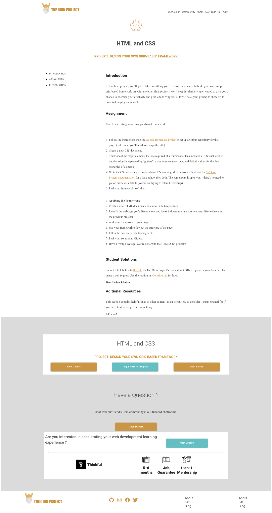

# Microverse Framework Project

In this project, we'll be building from scratch a copy of "[The Odin Project](https://www.theodinproject.com/courses/html5-and-css3/lessons/design-your-own-grid-based-framework)". 

our solution: 

The goal of this project is to build a framework and use it to construct a website of our choice.

>The original specification of the project can be found at [The Odin Project](https://www.theodinproject.com/courses/html5-and-css3/lessons/design-your-own-grid-based-framework).

## Built With

- **HTML**
- **CSS**
- **SCSS**
- [**SharkTooth Framework**](https://github.com/Kasuhira/framework-project/tree/feature-branch)

## Live Demo

- [Master branch](http://raw.githack.com/Kasuhira/microverse-framework/master/index.html)
- [Framework branch](http://raw.githack.com/Kasuhira/microverse-framework/framework-branch/index.html)

## Authors

**Henrique Hefler**

- Github: [@Kasuhira](https://github.com/Kasuhira)

**Barak Ben-Hamu**

- Github: [@certilremy](https://github.com/certilremy)

## Contributing

Contribution, issues and feature requests are welcome!

## Suport

Give a star if you liked this project.
